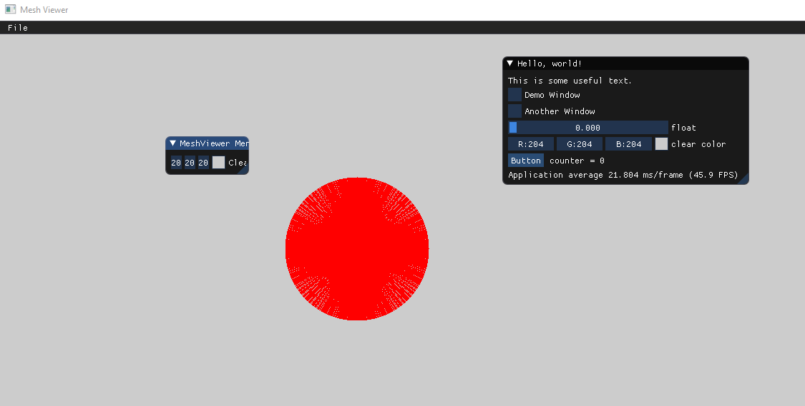
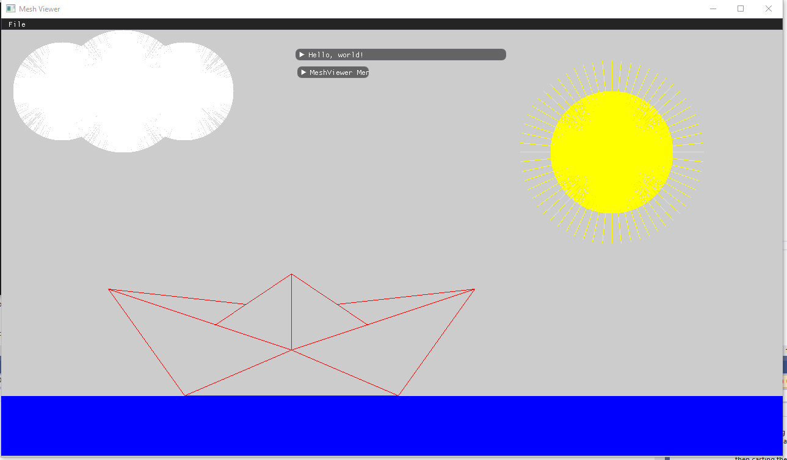

## Assignment no.1


```cpp

void Renderer::DrawLine(const glm::ivec2& p1, const glm::ivec2& p2, const glm::vec3& color)
{
    float x1 = p1[0], x2 = p2[0];
    float y1 = p1[1], y2 = p2[1];

    if (x1 > x2)
    {
        float tmpX = x1;
        x1 = x2;
        x2 = tmpX;

        float tmpY = y1;
        y1 = y2;
        y2 = tmpY;
    }

    float x = x1, y = y1;
    float deltaX = x2 - x1, deltaY = y2 - y1;

    //vertical line case
    if (deltaX == 0)
    {
        if (y1 > y2)
        {
            float tmpY = y1;
            y1 = y2;
            y2 = tmpY;
            y = y1;
        }
        while (y <= y2)
        {
            PutPixel(x, y, color);
            y++;
        }
        return;
    }

    //claculate the slope
    float slope = (deltaY) / (deltaX);
    float e = -1 * deltaX, c = y1 - (slope * x1);

    //check slope cases
    //moderte positive slope
    if (slope > 0 && slope < 1)
    {
        while (x <= x2)
        {
   
            //increase y
            if (e > 0)
            {
                y++;
                e = e - 2 * deltaX;
            }
            PutPixel(x, y, color);
            //increase x
            x++;
            e = e + 2 * deltaY;
        }
    }
    //steep positive slope
    else if (slope >= 1)
    {
        e = -1 * deltaY;
        while (y <= y2)
        {
            //increase x
            if (e > 0)
            {
                x++;
                e = e - 2 * deltaY;
            }
            PutPixel(x, y, color);
            //increase y
            y++;
            e = e + 2 * deltaX;
        }
    }
    //moderate negative slope
    else if (slope < 0 && slope > -1)
    {
        e = deltaX;
        while (x <= x2)
        {
            //decrease y
            if (e < 0)
            {
                y--;
                e = e + 2 * deltaX;
            }
            //increase x
            PutPixel(x, y, color);
            x++;
            e = e + 2 * deltaY;
        }
    }
    //steep negative slope
    else if (slope <= -1)
    {
        e = deltaY;

        while (y >= y2)
        {
            //increase x
            if (e > 0)
            {
                x++;
                e = e + 2 * deltaY;
            }
            //decrease y
            PutPixel(x, y, color);
            y--;
            e = e + 2 * deltaX;
        }
    }
    //horizontal line case
    else if (slope == 0)
    {
        while (x <= x2)
        {
            PutPixel(x, y, color);
            x++;
        }
    }
}
```

## Draw Code:

```cpp

void Renderer::drawCircle( const glm::vec2& center, float radius, const glm::vec3& color) 
{
    int step = 1000;
   
    for (int i = 0; i < step; i++)
    {
        const glm::ivec2 point(center[0] + radius * sin((2*M_PI * i) / step), center[1] + radius * cos((2 * M_PI * i) / step));
        Renderer::DrawLine(center, point, color);
    }

}

void Renderer::Render(const Scene& scene)
{
    // TODO: Replace this code with real scene rendering code
    int half_width = viewport_width / 2;
    int half_height = viewport_height / 2;
 
 //sun 
    const glm::ivec2 center(1000, 500);
    const glm::ivec3 sunColor(1, 1, 0);
    float radius = 100;

    Renderer::drawCircle(center, radius, sunColor);
   
    //sun rays
    int step = 60;
    radius = 150;
    for (int i = 0; i < step; i++)
    {
        const glm::ivec2 point(center[0] + radius * sin(2 * M_PI * i / step), center[1] + radius * cos(2 * M_PI * i / step));
        Renderer::DrawLine(center, point, sunColor);
    }
 

    //paper ship draw
    const glm::ivec3 shipColor(1, 0, 0);
    const glm::ivec2 a(300, 100);
    const glm::ivec2 b(650, 100);
    const glm::ivec2 c(175, 275);
    const glm::ivec2 d(775, 275);
    const glm::ivec2 e(475, 175);
    const glm::ivec2 f(475, 300);
    const glm::ivec2 g(400, 250);
    const glm::ivec2 h(550, 250);
    const glm::ivec2 i(350, 216.65);
    const glm::ivec2 j(600, 216.65);
    Renderer::DrawLine(a, b, shipColor);
    Renderer::DrawLine(b, d, shipColor);
    Renderer::DrawLine(c, a, shipColor);
    Renderer::DrawLine(a, e, shipColor);
    Renderer::DrawLine(e, b, shipColor);
    Renderer::DrawLine(e, f, shipColor);
    Renderer::DrawLine(c, g, shipColor);
    Renderer::DrawLine(h, d, shipColor);
    Renderer::DrawLine(c, e, shipColor);
    Renderer::DrawLine(e, d, shipColor);
    Renderer::DrawLine(i, f, shipColor);
    Renderer::DrawLine(f, j, shipColor);


    //draw sea

    const glm::ivec3 seaColor(0, 0, 1);
    int height = 99;
    for (int i = 1; i < 99; i++)
    {
        const glm::ivec2 seaPoint1(0, height);
        const glm::ivec2 seaPoint2(1280, height);
        Renderer::DrawLine(seaPoint1, seaPoint2, seaColor);
        height--;
    }


    //draw clouds
    const glm::ivec3 cloudColor(1, 1, 1);
    const glm::ivec2 center1(100, 600);
    float radius1 = 80;
    const glm::ivec2 center2(200, 600);
    float radius2 = 100;
    const glm::ivec2 center3(300, 600);


    Renderer::drawCircle(center1, radius1, cloudColor);
    Renderer::drawCircle(center2, radius2, cloudColor);
    Renderer::drawCircle(center3, radius1, cloudColor);


}
```

## Sanity Check:



## Final Draw:


